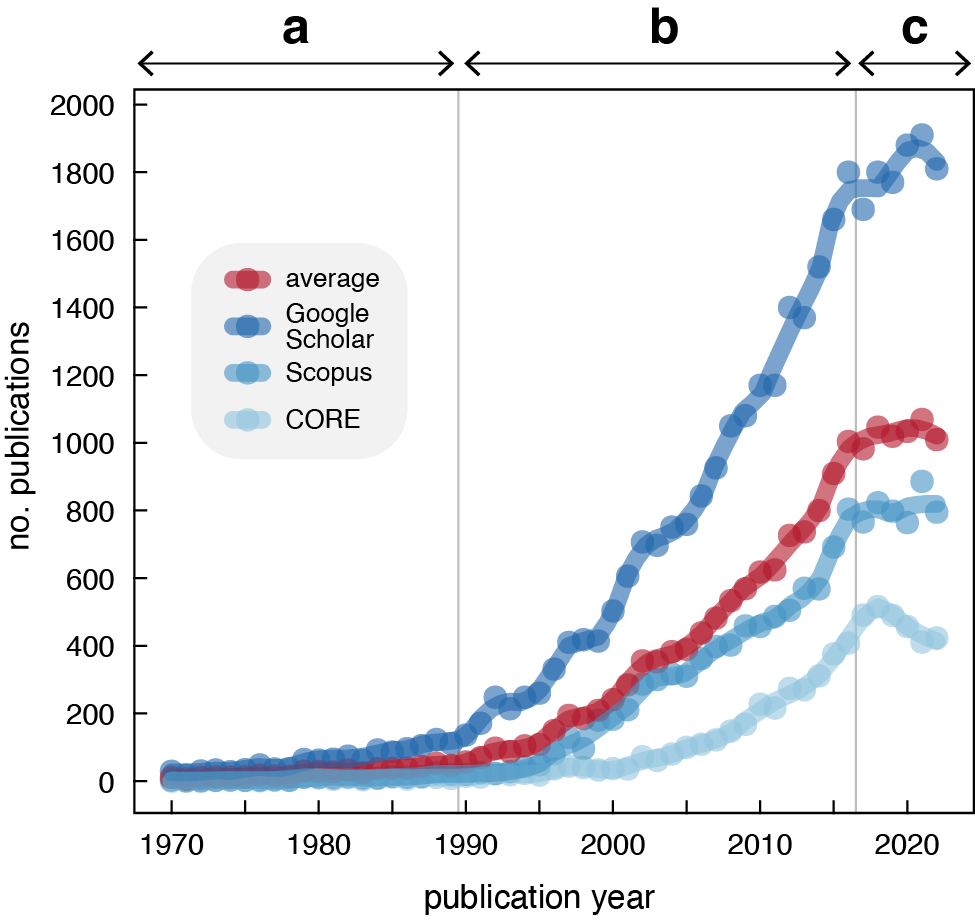

# historical_20Qs

Data and code for **"Global research priorities for historical ecology to inform conservation"**, published open access in *Endangered Species Research*.

[](https://doi.org/10.3354/esr01338)
[](LICENSE)
[](https://www.r-project.org/)

> McClenachan L, Rick T, Thurstan RH, Trant A, Alagona PS, *et al.* (2024) Global research priorities for historical ecology to inform conservation. *Endangered Species Research* 54:285–310. https://doi.org/10.3354/esr01338

This repository holds the survey data, bibliometric data, and R scripts used to generate the three figures in the paper. The project was led from the outset by L. McClenachan and K. S. Van Houtan, and synthesizes input from a global author group spanning history, anthropology, paleontology, and ecology across six continents.

---

## Abstract

Historical ecology draws on a broad range of information sources and methods to provide insight into ecological and social change, especially over the past ~12,000 years. While its results are often relevant to conservation and restoration, insights from its diverse disciplines, environments, and geographies have frequently remained siloed or underrepresented, restricting their full potential. Here, scholars and practitioners working in marine, freshwater, and terrestrial environments on six continents and various archipelagoes synthesize knowledge from history, anthropology, paleontology, and ecology to describe global research priorities for historical ecology to influence conservation. We used a structured decision-making process to identify and address questions in four key priority areas: (i) methods and concepts, (ii) knowledge co-production and community engagement, (iii) policy and management, and (iv) climate change impacts. This work highlights how historical ecology has developed and matured in its use of novel information sources, efforts to move beyond extractive research practices and toward knowledge co-production, and application to management challenges including climate change. We demonstrate how this field has brought together researchers across disciplines, connected academics to practitioners, and engaged communities to create and apply knowledge of the past to address the challenges of our shared future.

---

## Repository structure

```
historical_20Qs/
├── historical_20Qs.Rproj      # RStudio project; anchors all relative paths
├── README.md
├── LICENSE                    # MIT
├── header.png                 # banner (a rendering of Figure 1)
├── data/
│   ├── citations2.csv         # bibliometric counts used by the figure script (canonical)
│   ├── citations.csv          # earlier single-term query (superseded; see Notes)
│   └── author_demogr.csv      # anonymized coauthor survey responses
├── script/
│   ├── 0_GS_citations.R       # → Figure 1 (publication time series)
│   ├── 1_author_demogr.R      # → Figure 2 (author demographics, 10 panels)
│   └── 2_FMNH_layout.R        # → Figure 3 (Randell Research Center photo montage)
├── image/
│   └── pic1.png … pic5.png    # source photos assembled into Figure 3
└── viz/
    ├── Figure1_HE_citations_31Jul.pdf
    ├── Figure2_author_POV_24Jun.pdf   # earlier draft
    ├── Figure2_author_POV_31Aug.pdf   # final
    ├── Figure3_FMNH_program.pdf
    └── rXiv/                  # archived intermediate outputs
```

---

## Data

### `data/citations2.csv` — bibliometric time series *(canonical)*
Annual counts of publications matching `"historical ecology" OR "historical ecological"`, tabulated independently from three databases, 1970–2022 (53 rows).

| Column | Description |
|---|---|
| `YEAR` | Publication year (1970–2022) |
| `GoogleScholar` | Annual hits from Google Scholar |
| `CORE` | Annual hits from CORE (core.ac.uk) |
| `Scopus` | Annual hits from Scopus |

The ensemble `average` across the three sources is computed at runtime in `0_GS_citations.R`, not stored in the file.

### `data/author_demogr.csv` — coauthor survey responses
Self-identified responses to the project demographics survey, one row per coauthor (36 anonymized records, `coauthor_no` 1–36). The file is in a **wide, multi-column-per-question** layout: several survey items (e.g. `discipline`, `work_region`, `professional_language`) span multiple adjacent columns sharing the same header, so that a respondent can select more than one value. `1_author_demogr.R` gathers this to long form, strips the de-duplicated `.x` suffixes R appends to repeated names, and drops blank cells before plotting.

Survey items (column groups): `sector`, `discipline`, `scholarly_approach`, `work_system`, `work_region`, `career_stage`, `gender`, `ethnicity`, `first_language`, `professional_language`.

All survey data are anonymized to remove personally identifying information.

---

## Scripts → figures

Scripts are numbered `0`–`2`; note the offset between script number and the figure each produces.

| Script | Reads | Produces | Manuscript figure |
|---|---|---|---|
| `0_GS_citations.R` | `data/citations2.csv` | LOESS-smoothed publication time series across the three databases plus their average, with vertical guides at 1989.5 and 2016.5 marking the three growth phases | **Figure 1** |
| `1_author_demogr.R` | `data/author_demogr.csv` | Ten-panel `patchwork` montage of coauthor demographics (affiliation, geography, demographics, language) using a ColorBrewer *Spectral* palette | **Figure 2** |
| `2_FMNH_layout.R` | `image/pic1.png … pic5.png` | Arranged photo montage of the Florida Museum of Natural History's Randell Research Center and Calusa Heritage Trail | **Figure 3** |

Each script defines the shared `themeKV` ggplot theme (built on `theme_few()`) so the figures share a consistent visual style.

The Figure 3 photographs were provided by Annisa Karim and Charles O'Connor and are used with permission.

---

## Reproducing the figures

1. Install [R](https://www.r-project.org/) (and ideally [RStudio](https://posit.co/download/rstudio-desktop/)).
2. Open `historical_20Qs.Rproj`. This sets the working directory to the repository root so every `read.csv('data/...')` and `readPNG('image/...')` call resolves via a relative path — no `setwd()` needed.
3. Install the required packages:

   ```r
   # Figure 1
   install.packages(c("ggplot2", "ggthemes", "RColorBrewer", "plyr",
                      "dplyr", "tidyr", "patchwork"))

   # Figure 2 (additional)
   install.packages(c("reshape", "data.table", "zoo", "forcats",
                      "scales", "ggridges", "colorspace"))

   # Figure 3 (additional)
   install.packages(c("grid", "gridExtra", "png", "figpatch", "lattice"))
   ```

4. Run the scripts from the project root, e.g. `source("script/0_GS_citations.R")`.

> **Note:** `figpatch` (used in `2_FMNH_layout.R`) is a less common CRAN package for embedding images in `patchwork` layouts; install it explicitly if it is not already present.

---

## Notes and known issues

A few small inconsistencies are documented here for transparency and future cleanup:

- **Figure-number comment in `2_FMNH_layout.R`.** The script header comment reads *"this script is for figure 2,"* but the Randell Research Center montage it produces is **Figure 3** in the published paper. The output filename (`viz/Figure3_FMNH_program.pdf`) is correct; only the in-script comment is stale.
- **Two citation files.** `citations2.csv` (three databases, wide format) is the file the figure script actually reads and is canonical. `citations.csv` is an earlier query of the single term `"historical ecology"` in long format (`YEAR`, `SEARCH`, `CITATIONS`) and is retained only for provenance; it is **not** used to build Figure 1.
- **Commented absolute paths.** Both data scripts contain a commented-out `setwd("/Users/kylevanhoutan/historical_20Qs/")`. These are inert because the `.Rproj` supplies the working directory, but they can be removed safely.
- **Coauthor count.** `author_demogr.csv` contains 36 anonymized coauthor records; the paper reports *n* = 37 survey respondents. The difference reflects survey participation versus the records retained here.
- **`Rplot.pdf`** at the repository root appears to be a default graphics-device output and can likely be removed.

---

## License

Released under the MIT License — see [LICENSE](LICENSE). © 2023 Kyle Van Houtan.

## Contact

Questions about the analysis or data are welcome via the repository [issues](https://github.com/vanhoutan/historical_20Qs/issues). Corresponding author for the paper: Loren McClenachan (lorenm@uvic.ca).
